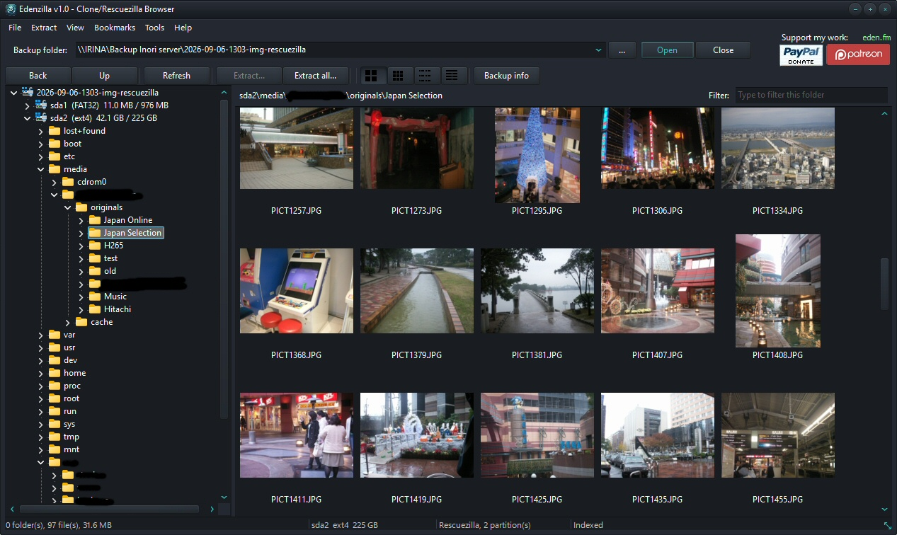
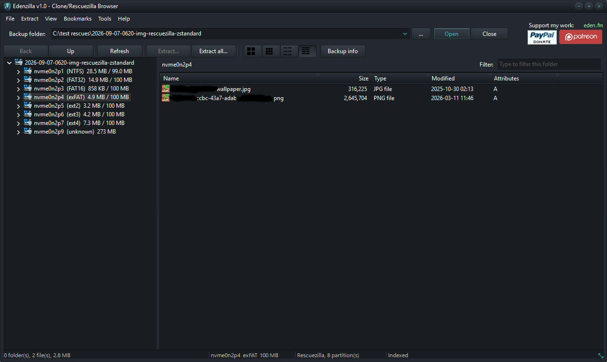
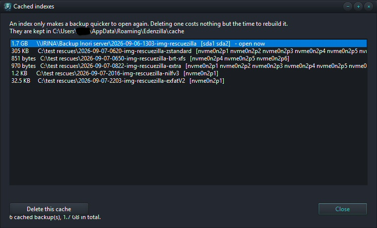
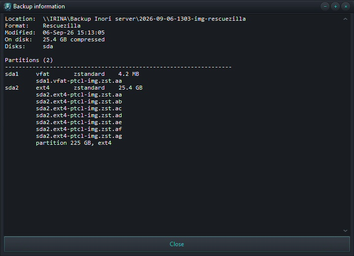
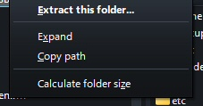

# Edenzilla

**Native Clonezilla, Rescuezilla & disk image browser for Windows**

Edenzilla lets you browse Clonezilla and Rescuezilla backups, navigate their files and extract exactly what you need — without restoring the image or mounting the backup.

It can also open standalone disk image files directly, including `.img`, `.raw`, `.dd` and `.ptcl-img`.

## Features

* Browse Clonezilla and Rescuezilla backups
* Open standalone disk image files
* Extract individual files and folders
* Automatically rejoin split image volumes
* Random access through indexed compressed streams
* Native partclone v1 and v2 support
* No mounting or virtual drives required
* No filesystem drivers required
* No external tools or command-line utilities required
* Cached indexes for faster subsequent access

## Native Image Processing

Everything is handled natively by Edenzilla.

Split image volumes are rejoined, compressed streams are decoded and indexed for random access, partclone containers are unwrapped, and the filesystem inside is read directly.

**No drive is mounted. No filesystem driver is installed. No external program is required.**

## Supported Formats

| Filesystems | Compression  | Containers    | Image Files |
| ----------- | ------------ | ------------- | ----------- |
| ext2/3/4    | Uncompressed | partclone v1  | `.img`      |
| Btrfs       | gzip         | partclone v2  | `.raw`      |
| XFS         | bzip2        | raw dd images | `.dd`       |
| f2fs        | zstandard    |               | `.ptcl-img` |
| jfs         |              |               |             |
| ReiserFS    |              |               |             |
| Nilfs2      |              |               |             |
| LVM2        |              |               |             |
| NTFS        |              |               |             |
| FAT12/16/32 |              |               |             |
| exFAT       |              |               |             |
| HFS+        |              |               |             |

## Download

Download the latest Windows version from:

**https://eden.fm/downloads#app-Edenzilla**

## Index Cache

Edenzilla caches filesystem indexes to speed up subsequent access.

```text
C:\Users\<username>\AppData\Roaming\Edenzilla\cache
```

## Requirements

* Windows 10 or later
* No additional drivers required
* No external utilities required

## Source Code

Edenzilla is proprietary, closed-source software.

This repository contains the compiled application and release information only. The source code is not included.

## License

Edenzilla is proprietary software developed by Eden Tokyo.

See [LICENSE](LICENSE) for the applicable license terms.

## Screenshots










